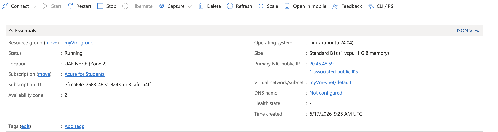
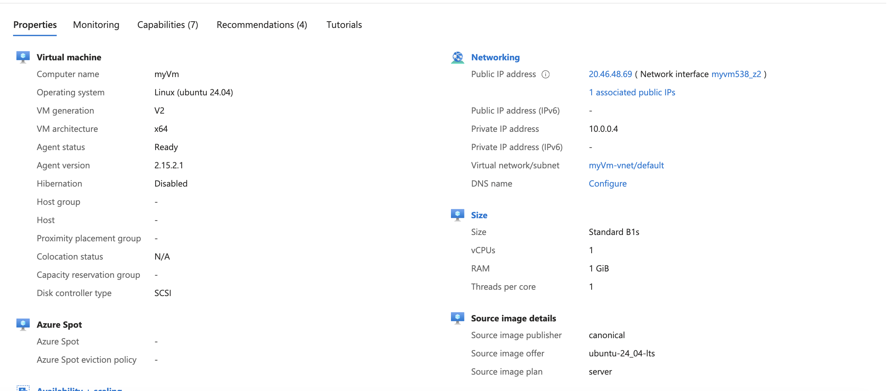
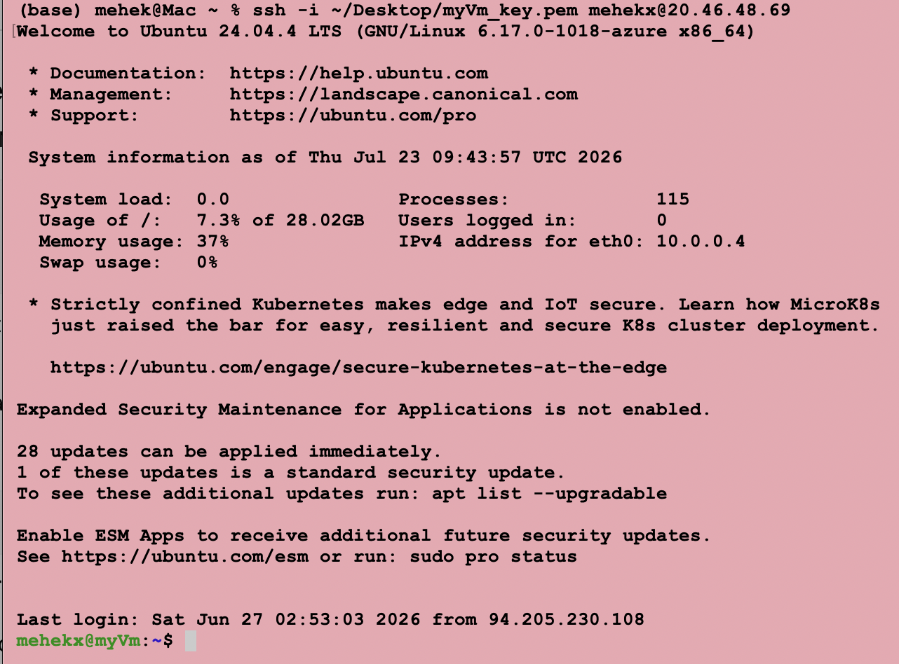

# Azure Server Setup

## Step 1 — Get a Cloud VM

I used an Ubuntu 24.04 LTS virtual machine built in Microsoft Azure using the Standard B1S size.

  You can also use: AWS or DigitalOcean

### Figure 1 - Azure Virtual Machine Overview



---

## Step 2 - Verify the Virtual Machine Properties

The VM properties confirm the operating system, networking configuration, and public IP address.

Create:

Ubuntu VM
Open ports:
22 (SSH)
80 (HTTP)
443 (HTTPS)

### Figure 2 - Azure Virtual Machine Properties



---
## Step 3 - Download the New Key pair 

After the VM configuration is complete, your .pem file will be generated. It is a private key Azure made for you. Store it somewhere safe on your device and remember the path so it is accessible. 

### Figure 3 - SSH Connection into the VM


## Step 4 - Finally Connect to the Server

In terminal-

```bash
chmod 600 ~/YOUR_PATH/key.pem
```

```bash
ssh -i key.pem azureuser@YOUR_PUBLIC_IP
```

### Figure 4 - SSH Connection into the VM





