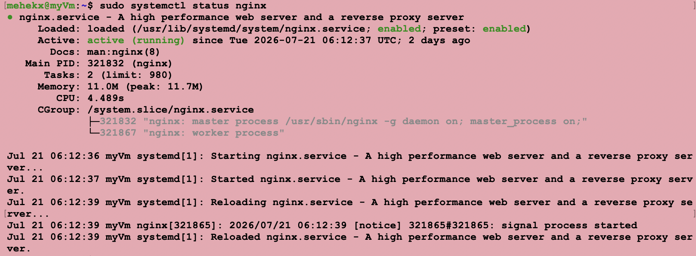

# Azure Server Setup

## Step 1 — Get a Cloud VM

An Ubuntu 24.04 LTS virtual machine was built in Microsoft Azure using the Standard B1S size.

  You can also use: AWS or DigitalOcean

### Figure 1 - Azure Virtual Machine Overview


---

## Step 2 - Verify the Virtual Machine Properties

The VM properties confirm the operating system, networking configuration, and public IP address.

Create:

Ubuntu VM
Open ports:
22 (SSH)
80 (HTTP)
443 (HTTPS)

### Figure 2 - Azure Virtual Machine Properties


---
## Step 3 - Download the New Key pair 

After the VM configuration is complete, your .pem file will be generated. It is a private key Azure made for you. Store it somewhere safe on your device and remember the path so it is accessible. 

### Figure 3 - SSH Connection into the VM


## Step 4 - Connect to the Server

In terminal-

```bash
chmod 600 ~/YOUR_PATH/key.pem
```

```bash
ssh -i key.pem azureuser@YOUR_PUBLIC_IP
```

### Figure 4 - SSH Connection into the VM


## Step 5 — Update Ubuntu

Before installing the web server, the Ubuntu package lists were refreshed and the available system updates were installed. This ensures that current package versions and security updates are applied.

```bash
sudo apt update
sudo apt upgrade -y
```

- `sudo apt update` refreshes the list of available packages.
- `sudo apt upgrade -y` installs the available package updates automatically.


## Step 6 — Install Nginx

Nginx was installed as the web server used to deliver website content over HTTP and HTTPS.

```bash
sudo apt install nginx -y
```

After installation, the service status was checked:

```bash
sudo systemctl status nginx --no-pager
```

A successful installation should show:

```text
Active: active (running)
```

Nginx was also enabled to start automatically whenever the virtual machine restarts:

```bash
sudo systemctl enable nginx
```

### Figure 7 — Nginx Installed and Running



---

## Step 8 — Test the Nginx Web Server

The Nginx installation was tested by entering the Azure virtual machine's public IP address into a web browser:

```text
http://20.46.48.69
```

Anyone reproducing this setup should replace the address with their own VM public IP:

```text
http://YOUR_PUBLIC_IP
```

The default **Welcome to nginx!** page confirmed that:

- Nginx was installed successfully.
- The Nginx service was running.
- Port `80` was accessible.
- The Azure VM could serve web content over HTTP.

### Figure 6 — Nginx Default Web Page


---

## Next Step

After confirming that Nginx worked through the VM's public IP address, a custom domain was purchased and configured to point to the server.

Continue to: [DNS Configuration](02-DNS-Configuration.md)

