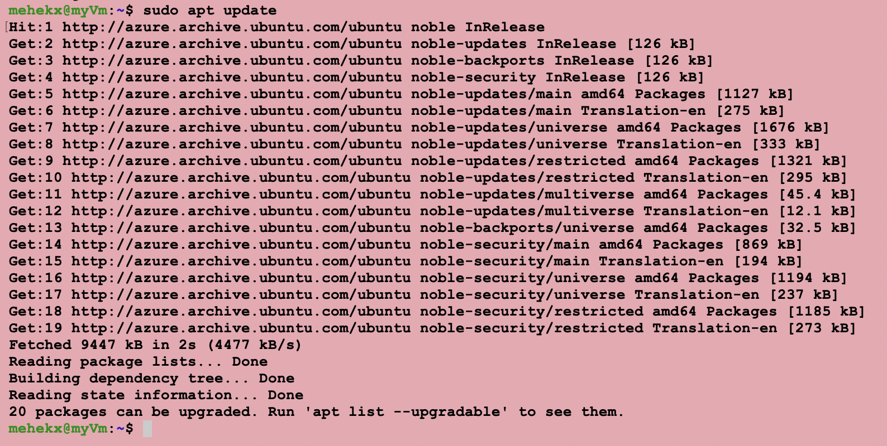

# Azure Server Setup

## Create the Virtual Machine

An Ubuntu 24.04 LTS virtual machine was created in Microsoft Azure using the Standard B1s size.

### Figure 1 - Azure Virtual Machine Overview


---

## Verify the Virtual Machine Properties

The VM properties confirm the operating system, networking configuration, and public IP address.

### Figure 2 - Azure Virtual Machine Properties


---

## Connect to the Server

```bash
ssh azureuser@20.46.48.69
```

### Figure 3 - SSH Connection


---

## Update Ubuntu

```bash
sudo apt update
sudo apt upgrade -y
```

### Figure 4 - Ubuntu Update


