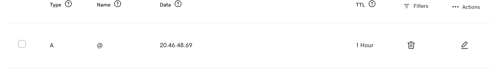

# DNS Configuration

After Nginx was installed and tested through the Azure virtual machine's public IP address, a custom domain was connected to the server.

For this project:

| Item | Value |
|---|---|
| Domain registrar | GoDaddy |
| Domain | `mehekx.com` |
| Azure VM public IP | `20.46.48.69` |
| DNS record type | `A` |

Anyone reproducing this setup should replace the domain and IP address with their own values.

---

## Step 1 — Register a Domain

The custom domain used for this project was registered through GoDaddy:

```text
mehekx.com
```

A custom domain provides a readable address for the server instead of requiring users to enter its public IP address.

Other domain registrars can also be used, but the location and names of the DNS settings may differ.

---

## Step 2 — Find the Azure VM Public IP Address

The virtual machine's public IP address can be found in the Azure portal:

1. Open **Virtual machines**.
2. Select the required virtual machine.
3. Open the **Overview** page.
4. Locate the **Public IP address**.

The Azure VM public IP used in this project was:

```text
20.46.48.69
```

This address was used as the destination of the DNS record.

---

## Step 3 — Open the DNS Management Page

In GoDaddy:

1. Sign in to the GoDaddy account.
2. Open the domain portfolio.
3. Select the required domain.
4. Open the **DNS** section.
5. Select **DNS Records**.

The DNS records determine where requests for the domain are directed.

---

## Step 4 — Create the A Record

An `A` record was created to connect the root domain to the Azure VM's IPv4 address.

The following values were used:

| Setting | Value |
|---|---|
| Type | `A` |
| Name | `@` |
| Data | `20.46.48.69` |
| TTL | `1 Hour` |

The `@` symbol represents the root domain:

```text
mehekx.com
```

The record therefore directs requests for `mehekx.com` to the Azure VM at `20.46.48.69`.



---

## Step 5 — Wait for DNS Propagation

DNS changes may not take effect immediately.

The propagation time depends on the DNS provider and the record's TTL. With a TTL of one hour, cached DNS information may remain available for up to that period before being refreshed.

---

## Step 6 — Verify DNS Resolution

After the DNS record was saved, the domain was tested from a local Mac Terminal using:

```bash
dig +short mehekx.com
```

The command returned:

```text
20.46.48.69
```

This confirmed that the domain was resolving to the Azure VM's public IP address.


The domain can also be checked on Windows, Linux or macOS using:

```bash
nslookup mehekx.com
```

The returned IP address should match the public IP of the cloud server.

---

## Step 7 — Test the Domain in a Browser

After DNS propagation completed, the domain was opened in a browser:

```text
http://mehekx.com
```

At this stage, the Nginx website loaded through the custom domain using HTTP. This confirmed that:

- The DNS record was configured correctly.
- The domain resolved to the Azure virtual machine.
- Nginx responded to requests sent through the domain.
- HTTP port `80` was accessible.

HTTPS was configured in the next stage using Let’s Encrypt and Certbot.

---

## Next Step

After the custom domain was connected to the Azure VM, an SSL certificate was installed to provide secure HTTPS access.

Continue to: [SSL and HTTPS Configuration](03-SSL-Configuration.md)
