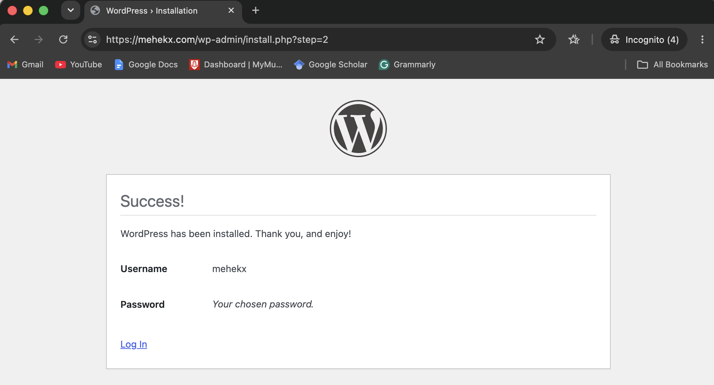
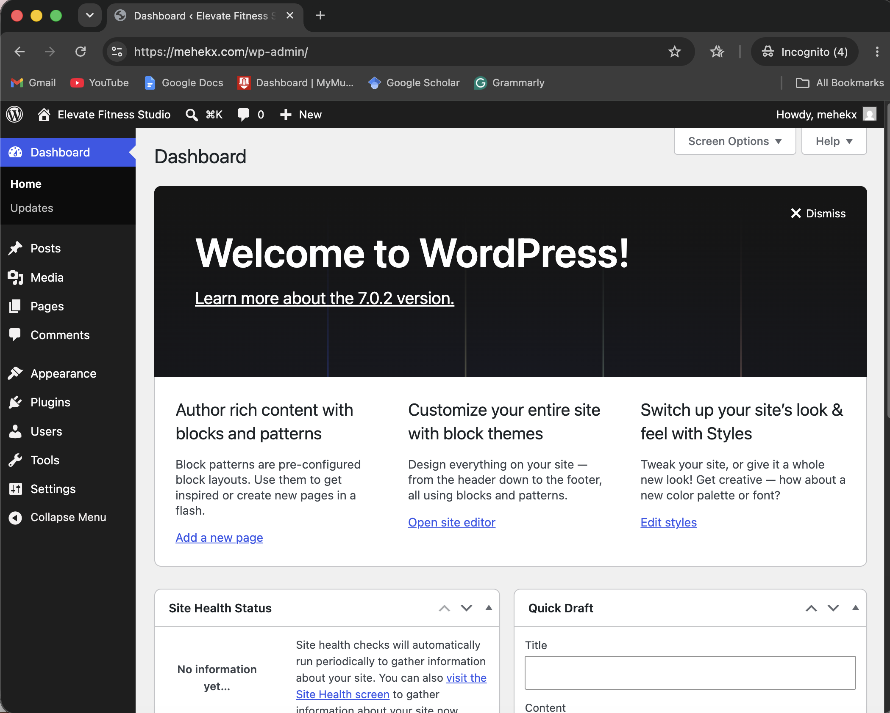
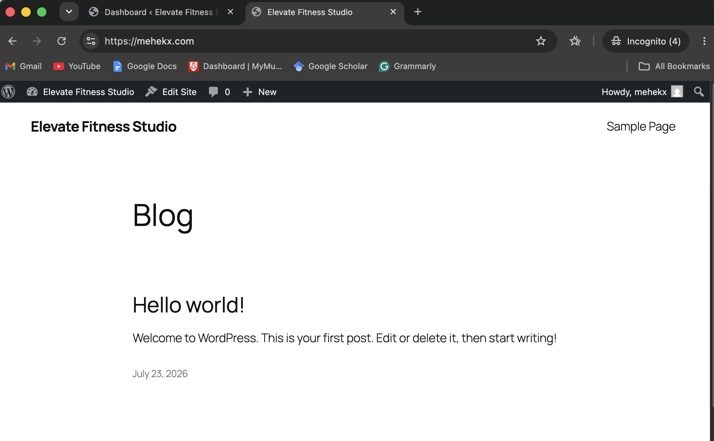
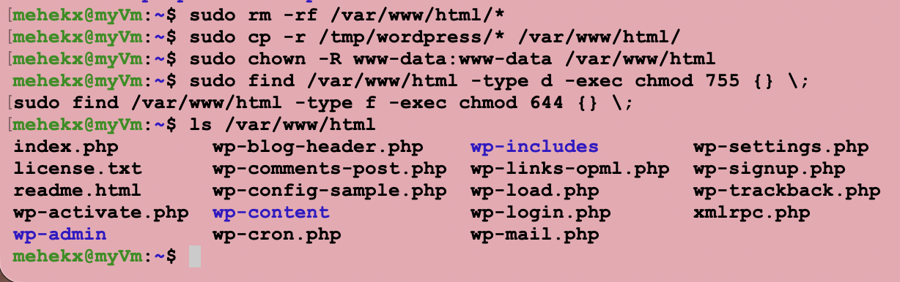

# WordPress Installation

## Overview

This document describes the installation and configuration of WordPress on the Azure Ubuntu 24.04 virtual machine. The deployment follows an Infrastructure as a Service (IaaS) model, where all software components were installed and configured manually.

WordPress serves as the public website for Elevate Fitness Studio and is hosted on the custom domain:

```text
https://mehekx.com
```

---

## Environment

| Component | Version |
|---|---|
| Operating System | Ubuntu Server 24.04 LTS |
| Web Server | Nginx |
| PHP | PHP 8.3 |
| Database | MySQL Community Server 8 |
| CMS | WordPress (Latest Stable Release) |

---

## Download WordPress

The latest stable version of WordPress was downloaded from the official WordPress website and extracted on the Ubuntu server.

```bash
cd /tmp
wget https://wordpress.org/latest.tar.gz
tar -xzf latest.tar.gz
```

The extracted WordPress files were prepared for deployment.


---

## Configure the Database

A dedicated MySQL database and database user were created for WordPress. This separated the WordPress installation from other applications hosted on the same server.

The database credentials were then configured in the `wp-config.php` file to establish the connection between WordPress and MySQL.

The configuration file was validated before deployment.

```bash
sudo php -l /var/www/html/wp-config.php
```

---

## Configure Nginx

The Nginx virtual host configuration was updated to:

- Serve the WordPress website from `/var/www/html`
- Process PHP files using PHP-FPM
- Support WordPress permalink routing
- Reuse the existing Let's Encrypt SSL certificate configured during the previous HTTPS setup

After the configuration was updated, Nginx was tested and reloaded.

```bash
sudo nginx -t
sudo systemctl reload nginx
```

---

## Complete the Installation

The WordPress installation wizard was accessed through the custom domain.

```text
https://mehekx.com
```

The administrator account and website information were configured to complete the installation.

After completing the setup, WordPress confirmed that the installation was successful.



---

## Verify the Deployment

The deployment was verified by accessing both the WordPress administrator dashboard and the public website over HTTPS.

The following checks were completed:

- The public website loaded correctly over HTTPS.
- The WordPress administrator dashboard was accessible.
- The website successfully connected to the MySQL database.
- The existing SSL certificate remained valid.

### WordPress Dashboard



### Public Website



### Successful Deployment



---

## Outcome

WordPress was successfully deployed on the Azure virtual machine using a manual IaaS installation.

The website is:

- Fully operational
- Connected to a MySQL database
- Secured with HTTPS using a Let's Encrypt SSL certificate
- Accessible through the custom domain

This deployment provides the public-facing website for Elevate Fitness Studio and forms a core component of the cloud server solution developed for the ICT171 Cloud Server Project.

---

## Next Step

After WordPress was successfully installed, the Elevate Fitness Studio website was designed and customised using WordPress.

Continue to: [WordPress Website Development](05-WordPress-Website-Development.md)
