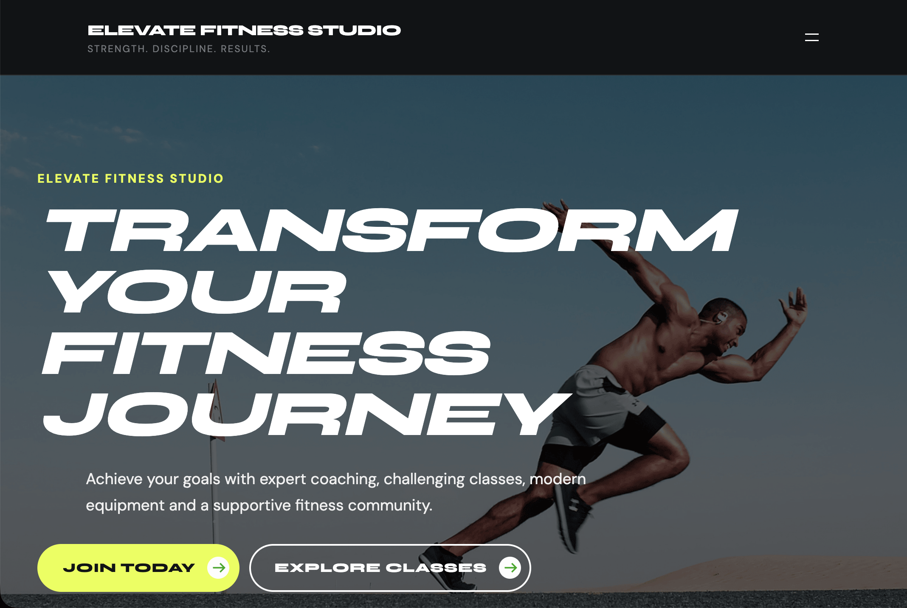
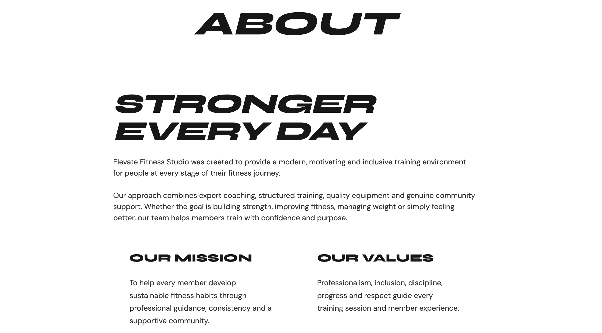
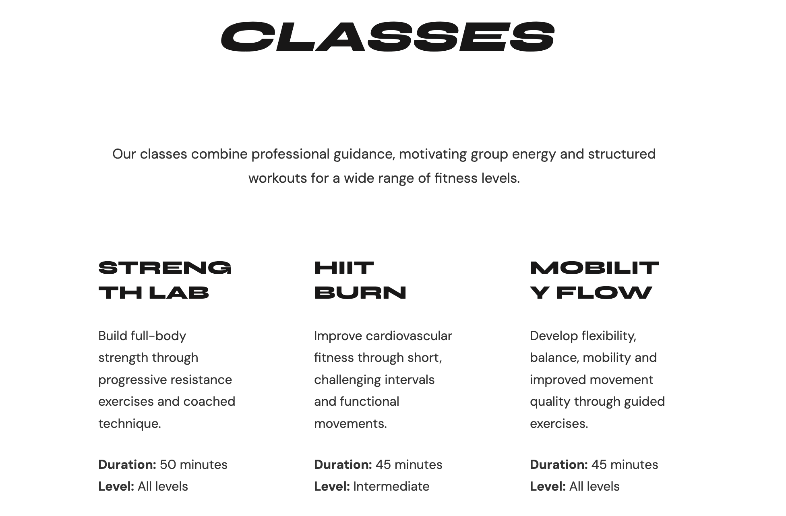
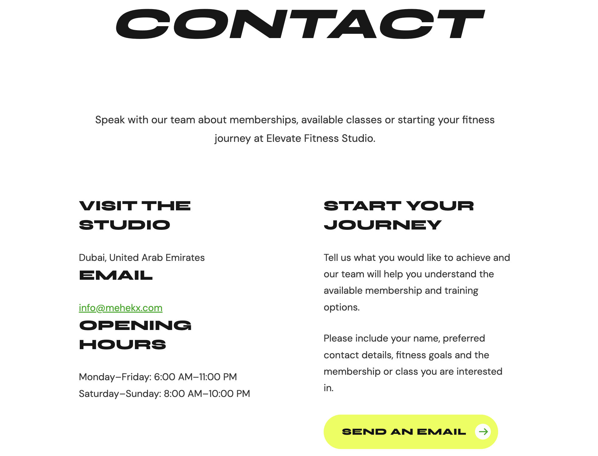

# WordPress Website Development

## Overview

After installing WordPress, the website was customised to represent a fictional business called **Elevate Fitness Studio**. The objective was to create a simple, professional website while following good web design practices.

Website URL:

**https://mehekx.com**

---

## Theme

A lightweight WordPress theme was used and customised to suit the branding of the fitness studio. Minor changes were made to improve the overall appearance and navigation.

---

## Website Structure

The website includes the following pages:

- Home
- About
- Classes
- Memberships
- Contact

These pages provide visitors with general information about the business and its services.

---

## Navigation

A simple navigation menu was implemented to allow users to move easily between pages. The website layout was kept consistent across all pages for a better user experience.

---

## Footer

A footer was added containing basic website information along with a link to the internal staff knowledge base (MediaWiki).

---

## Screenshots

### Home Page

---

### About Page

---

### Classes Page

---

### Memberships Page

---

### Contact Page

---

## Summary

The WordPress website was successfully customised to provide a clean and user-friendly interface for the fictional business. The final website includes multiple pages, consistent navigation, and integration with the MediaWiki staff knowledge base.

---

## Next

With the WordPress website completed, the next stage of the project is to deploy and configure [06 - MediaWiki](06-MediaWiki.md) as an internal staff knowledge base. This will provide a central location for storing documentation, procedures, and operational resources while integrating with the existing website.
