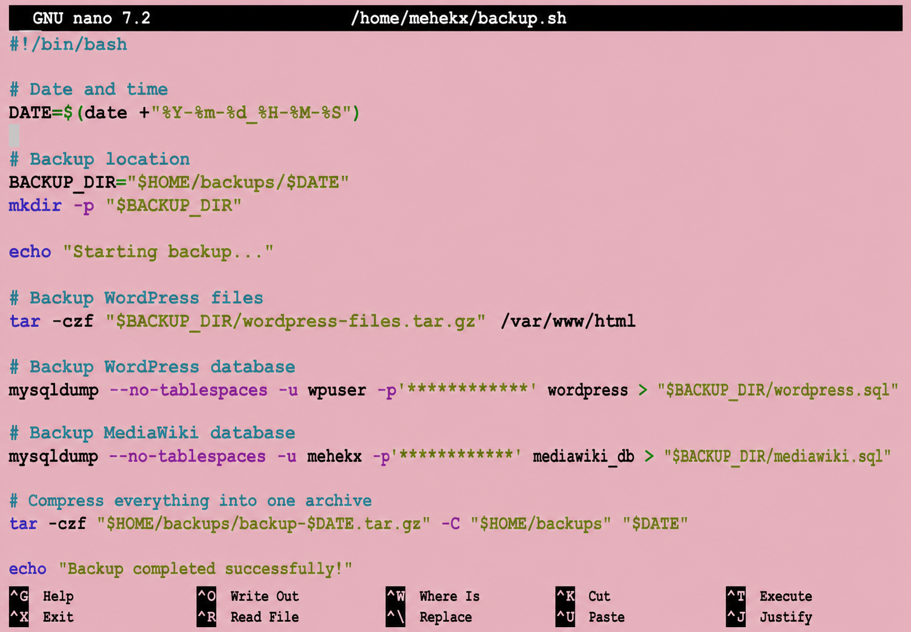
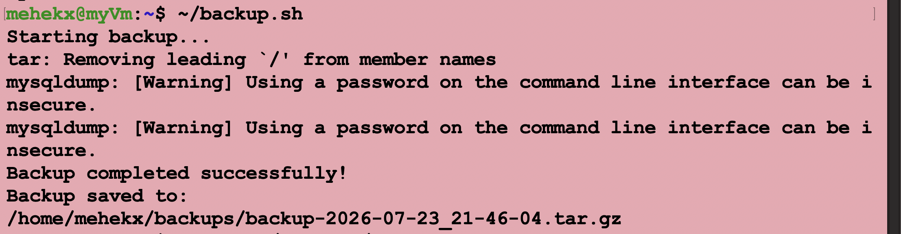
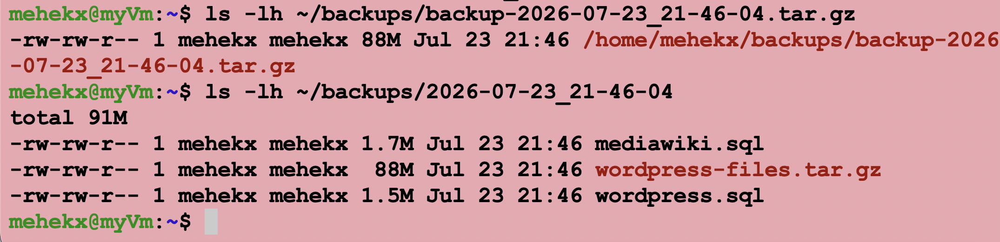

# Backup Script

## Overview

To improve reliability and data protection, an automated backup script was created to back up the website and database files. The script stores each backup in a timestamped directory before compressing the contents into a single archive for easier storage and management.

---

## Backup Process

The backup script performs the following tasks:

- Creates a backup directory using the current date and time.
- Backs up the WordPress website files.
- Backs up the WordPress database.
- Backs up the MediaWiki database.
- Compresses all backup files into a single archive.

The script can be executed whenever a backup is required.

---

## Running the Script

The backup script can be executed using the following command:

```bash
~/backup.sh
```

Once completed, the script confirms that the backup has been successfully created and displays the location of the backup archive.

---

## Backup Script Code

The script was created using Bash and automates the backup of the WordPress files, WordPress database and MediaWiki database.

```bash
#!/bin/bash

DATE=$(date +"%Y-%m-%d_%H-%M-%S")
BACKUP_DIR="$HOME/backups/$DATE"
ARCHIVE="$HOME/backups/elevate-fitness-backup-$DATE.tar.gz"

mkdir -p "$BACKUP_DIR"

echo "Backing up WordPress files..."
sudo tar -czf "$BACKUP_DIR/wordpress-files.tar.gz" /var/www/html

echo "Backing up WordPress database..."
mysqldump \
  --user=wpuser \
  --password="REDACTED" \
  --no-tablespaces \
  wordpress > "$BACKUP_DIR/wordpress-database.sql"

echo "Backing up MediaWiki database..."
mysqldump \
  --user=mehekx \
  --password="REDACTED" \
  --no-tablespaces \
  mediawiki_db > "$BACKUP_DIR/mediawiki-database.sql"

echo "Compressing the backup..."
tar -czf "$ARCHIVE" -C "$HOME/backups" "$DATE"

echo "Backup successfully created:"
echo "$ARCHIVE"
```

## Script Explanation

- `date` creates a unique timestamp for every backup.
- `mkdir -p` creates the backup directory.
- `tar` compresses the WordPress files and final backup directory.
- `mysqldump` exports the WordPress and MediaWiki databases.
- `--no-tablespaces` prevents database privilege errors.
- Output redirection (`>`) saves each database export as an SQL file.
- The final archive combines all backup files into one compressed file.

## Creating and Running the Script

The script was created using:

```bash
nano ~/backup.sh
```

Execution permission was then added:

```bash
chmod +x ~/backup.sh
```

The script was executed using:

```bash
~/backup.sh
```

The generated backup archives can be checked using:

```bash
ls -lh ~/backups
```

## Screenshots

### Screenshot 1 – Backup Script



---

### Screenshot 2 – Running the Backup Script



---

### Screenshot 3 – Backup Files Created




---

## Summary

The automated backup solution successfully creates backups of the website files and databases while packaging them into a compressed archive. This provides a simple recovery mechanism and helps protect the project against accidental data loss.

---

## Previous

⬅️ **Previous:** [07 - WireGuard](07-WireGuard.md)
